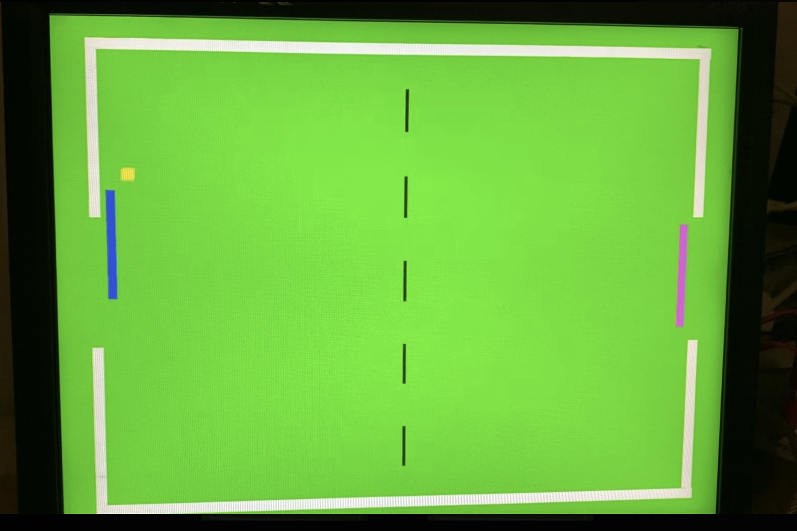
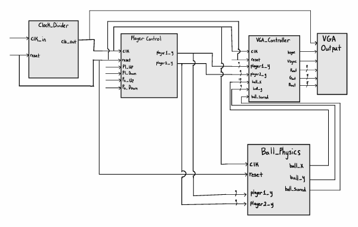
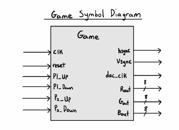
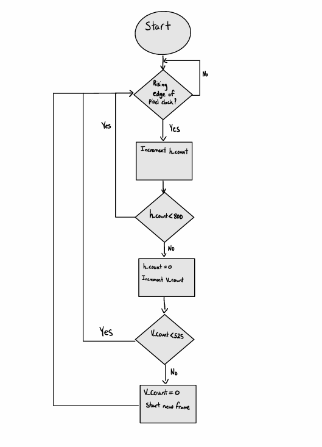
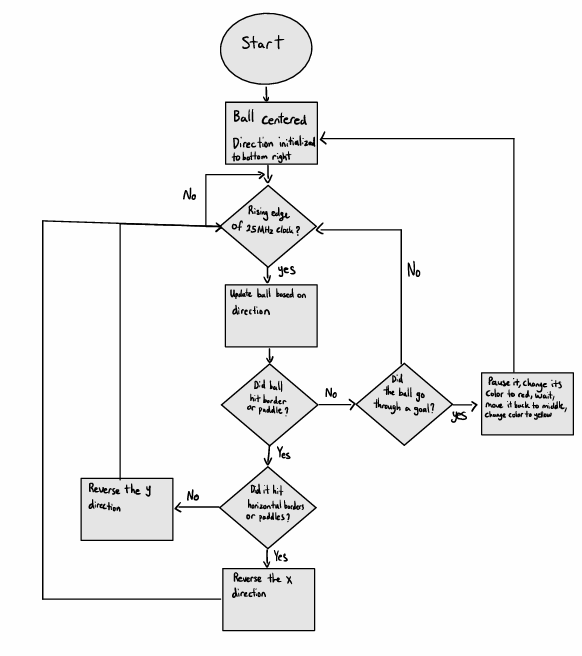
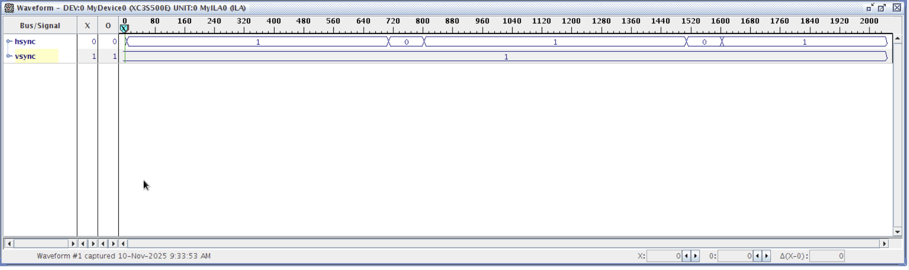
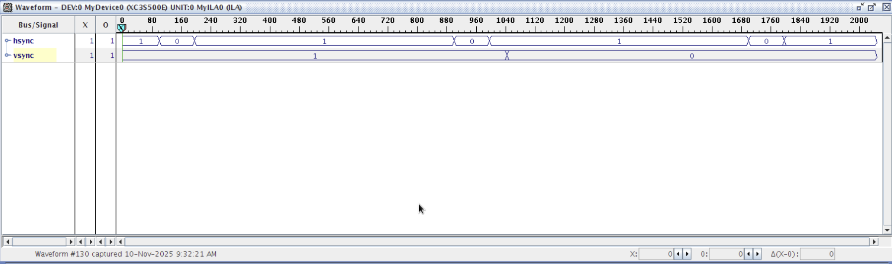
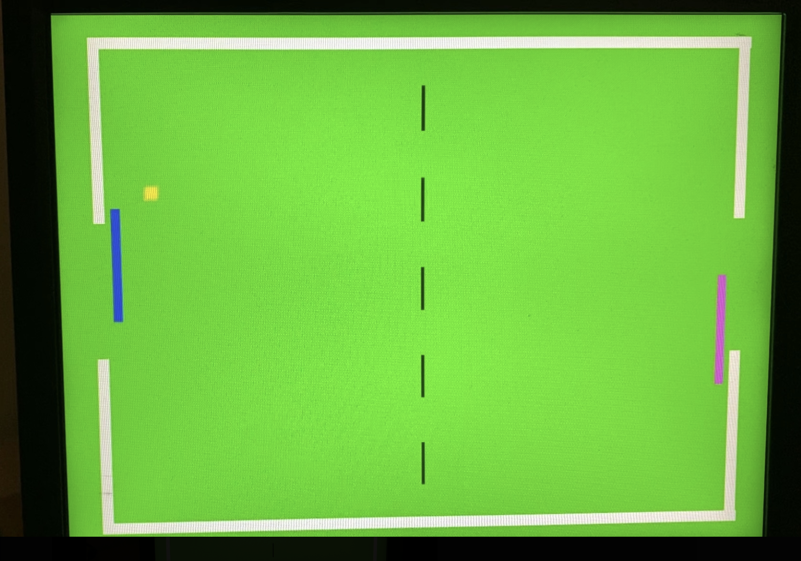
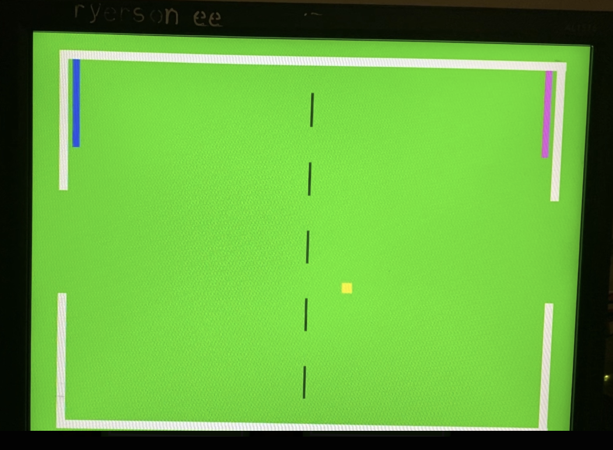
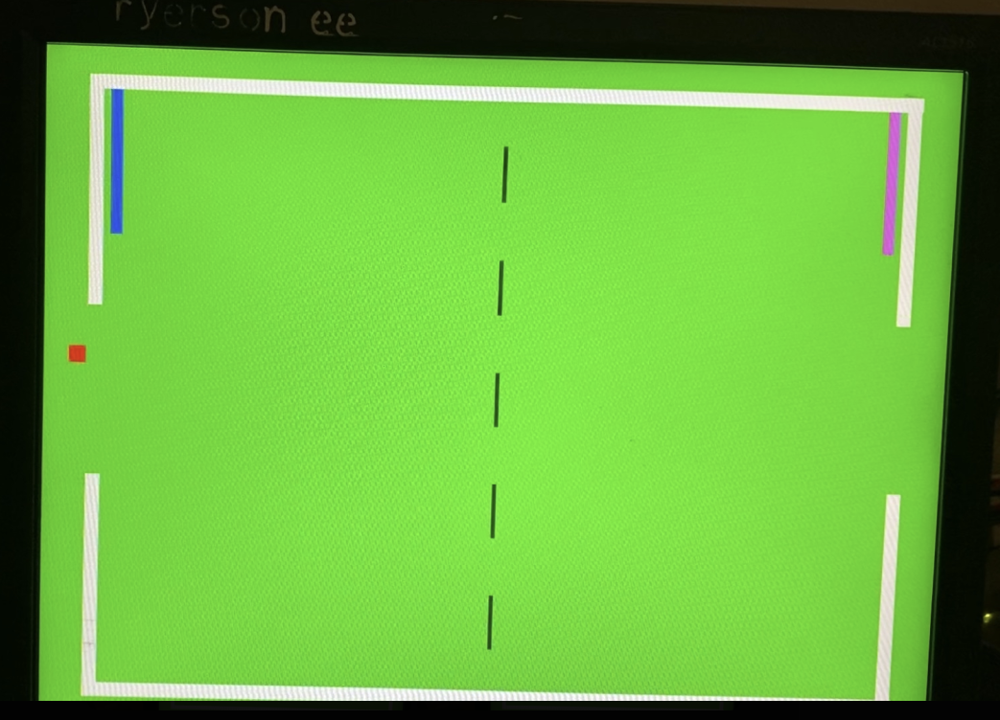

# VGA Game Processor (VHDL / FPGA)

A real-time, two-player Pong-style video game implemented entirely in **VHDL** and rendered directly to a monitor over **VGA**. The design does not use a CPU, framebuffer, or software game loop. Every visible pixel is generated from FPGA logic using VGA scan timing, coordinate comparisons, and synchronous game-state updates.



## Overview

This project generates a stable `640x480 @ 60 Hz` VGA signal from scratch and uses the active display area to draw a simple two-paddle game in real time:

- A green playfield bounded by white borders, with goal openings on the left and right edges
- Two independently controlled paddles, blue for Player 1 and pink for Player 2
- A yellow ball that moves across the field and bounces off borders and paddles
- Goal detection where the ball turns red, pauses briefly, then respawns at center

All video timing, collision detection, paddle movement, RGB generation, and game state are implemented in hardware and clocked from the FPGA board clock.

## Hardware

| Item | Details |
| --- | --- |
| **Board** | Xilinx Spartan-3E development board |
| **FPGA** | `XC3S500E` |
| **Toolchain** | Xilinx ISE / VHDL |
| **Input clock** | 50 MHz onboard clock |
| **Pixel clock** | 25 MHz, divided down on-chip |
| **Output** | VGA sync plus 8-bit red, green, and blue channels |
| **Inputs** | 4 paddle control switches plus reset |

## Architecture

The system is built from five single-purpose VHDL modules connected by the top-level `Game` entity.



| Module | File | Responsibility |
| --- | --- | --- |
| `Clock_Divider` | `src/Clock_Divider.vhd` | Divides the 50 MHz board clock down to the 25 MHz pixel clock required for 640x480 at 60 Hz timing. |
| `Player_Control` | `src/Player_Control.vhd` | Reads player switch inputs and updates each paddle's vertical position with movement throttling and boundary limits. |
| `Ball_Physics` | `src/Ball_Physics.vhd` | Tracks the ball's X/Y position and direction, detects border/paddle/goal collisions, and controls the red goal state. |
| `VGA_Controller` | `src/VGA_Controller.vhd` | Generates hsync/vsync timing and computes the RGB value of each pixel for the field, borders, paddles, center line, and ball. |
| `Game` | `src/Game.vhd` | Top-level structural entity that wires the modules together and connects optional ChipScope ICON/ILA debug signals. |



## Design Details

The project is organized around synchronous hardware blocks rather than a software update loop. The VGA controller continuously scans the screen, while the game logic updates paddle and ball positions at controlled intervals so movement remains visible and stable on the monitor.

**VGA controller process**



**Ball physics process**



## VGA Timing

The controller implements standard 640x480 at 60 Hz timing using a 25 MHz pixel clock.

| Timing Region | Visible | Front Porch | Sync Pulse | Back Porch | Total |
| --- | ---: | ---: | ---: | ---: | ---: |
| **Horizontal pixels** | 640 | 16 | 96 | 48 | 800 |
| **Vertical lines** | 480 | 10 | 2 | 33 | 525 |

Each pixel period is 40 ns. A full frame is `800 x 525 = 420,000` pixel cycles, giving a frame time of about 16.8 ms.

## Game Logic

- **Paddles** are 100 pixels tall, clamped within the playfield, and move one pixel per update using a counter-based movement delay in `Player_Control`.
- **Ball motion** is handled in `Ball_Physics` using integer X/Y position registers and direction values.
- **Border collisions** reverse the ball direction when it reaches the top, bottom, or closed side-wall sections.
- **Paddle collisions** reverse horizontal direction when the ball overlaps the active paddle region.
- **Goals** are 120-pixel openings in the left and right borders. When the ball fully passes through a goal opening, it is flagged as scored, drawn red, paused, reset to the center, and relaunched.

## Pin Mapping

From `constraints/game.ucf`:

| Signal | Pin | Signal | Pin |
| --- | --- | --- | --- |
| `clk` | C9 | `reset` | K17 |
| `hsync` | C5 | `vsync` | D5 |
| `dac_clk` | A4 | | |
| `P1_Up` | N17 | `P1_Down` | H18 |
| `P2_Up` | L14 | `P2_Down` | L13 |

`Rout`, `Gout`, and `Bout` are 8-bit output buses. See `constraints/game.ucf` for the full per-bit VGA DAC pin mapping.

## Results

The design was verified through timing captures and by observing the live game running on a VGA monitor.

**Timing capture: hsync/vsync**



**Timing capture: RGB output**



**Live gameplay**

| Ball bouncing near paddle | Goal state |
| --- | --- |
|  |  |



## Debugging

The top level includes ChipScope ICON/ILA wiring for on-chip debug capture. The trigger bus captures:

| Trigger Bits | Signal |
| --- | --- |
| `TRIG0(0)` | `hsync` |
| `TRIG0(1)` | `vsync` |
| `TRIG0(2)` | `dac_clk` |
| `TRIG0(10 downto 3)` | `Rout` |
| `TRIG0(18 downto 11)` | `Gout` |
| `TRIG0(26 downto 19)` | `Bout` |

The debug core files are included under `debug/ipcore_dir/`. If the ChipScope cores are unavailable in a different ISE setup, they can be regenerated through Xilinx CORE Generator or temporarily removed from `Game.vhd` for a non-debug build.

## Repository Structure

```text
.
├── README.md
├── constraints/
│   └── game.ucf
├── debug/
│   └── ipcore_dir/
├── docs/
│   ├── BUILD_NOTES.md
│   └── images/
├── project/
│   ├── Game.prj
│   └── VGA_Game.xise
└── src/
    ├── Game.vhd
    ├── Clock_Divider.vhd
    ├── Player_Control.vhd
    ├── Ball_Physics.vhd
    └── VGA_Controller.vhd
```

## Building It Yourself

This project was built in **Xilinx ISE** for a Spartan-3E target.

1. Open `project/VGA_Game.xise` in Xilinx ISE, or create a new ISE project.
2. Add all files under `src/`.
3. Add `constraints/game.ucf` as the UCF constraints file.
4. Set `Game.vhd` as the top-level module.
5. Add or regenerate the ChipScope ICON/ILA cores if using the debug version.
6. Run **Synthesize**, **Implement Design**, and **Generate Programming File**.
7. Program the FPGA board and connect a VGA monitor.
8. Use the switches mapped to `P1_Up`, `P1_Down`, `P2_Up`, and `P2_Down` to move the paddles.

See `docs/BUILD_NOTES.md` for more build details and notes about excluded ISE-generated files.

## Background

This was built as a digital systems design project exploring real-time VGA signal generation, synchronous hardware design, and FPGA-based game logic.

The repository focuses on the source code, constraints, build notes, and selected project images needed to understand and rebuild the design.
